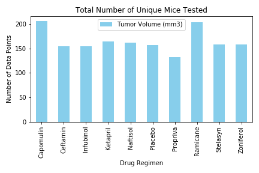
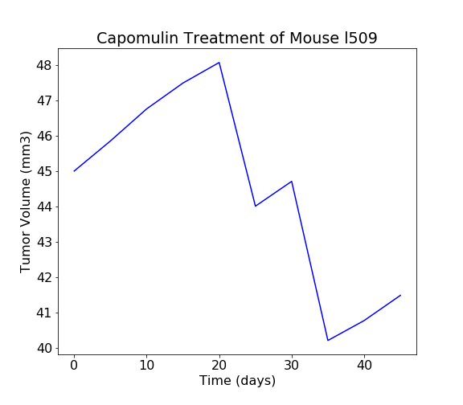
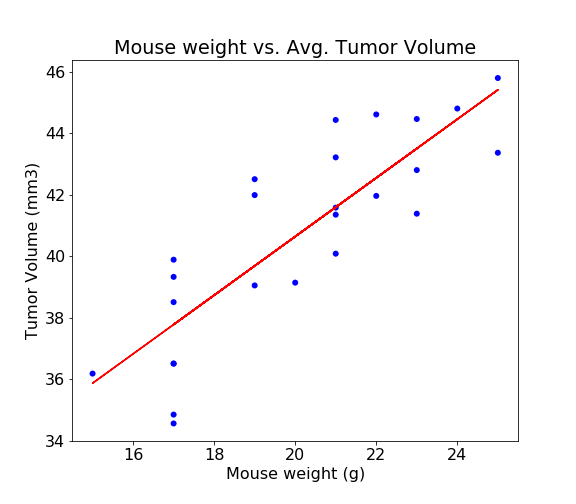

# Pymaceuticals Observations and Insights


- In this study, 248 mice identified with SCC tumor growth were treated through a variety of drug regimens. Over the course of 45 days, tumor development was observed and measured.
- The number of data points for each Drug Regimen were all above 100 and the study had a near identical number of male and female mice.
- Out of four drugs of interest (Capomulin, Ramicane, Infubinol, and Ceftamin) only Infubinol had one outlier data point and both Capomulin and Ramicane appeared to be equally effective.
- Mouse weight correlated strongly (0.84) with average tumor volume.

## MouseMeta Data

|      | Mouse ID | Drug Regimen |    Sex | Age_months | Weight (g) |
| ---: | -------: | -----------: | -----: | ---------: | ---------: |
|    0 |     k403 |     Ramicane |   Male |         21 |         16 |
|    1 |     s185 |    Capomulin | Female |          3 |         17 |
|    2 |     x401 |    Capomulin | Female |         16 |         15 |
|    3 |     m601 |    Capomulin |   Male |         22 |         17 |
|    4 |     g791 |     Ramicane |   Male |         11 |         16 |

## Study Result Data

|      | Mouse ID | Timepoint | Tumor Volume (mm3) | Metastatic Sites |
| ---: | -------: | --------: | -----------------: | ---------------: |
|    0 |     b128 |         0 |               45.0 |                0 |
|    1 |     f932 |         0 |               45.0 |                0 |
|    2 |     g107 |         0 |               45.0 |                0 |
|    3 |     a457 |         0 |               45.0 |                0 |
|    4 |     c819 |         0 |               45.0 |                0 |

## Datas Combined

|      | Mouse ID | Timepoint | Tumor Volume (mm3) | Metastatic Sites | Drug Regimen |    Sex | Age_months | Weight (g) |
| ---: | -------: | --------: | -----------------: | ---------------: | -----------: | -----: | ---------: | ---------: |
|    0 |     b128 |         0 |               45.0 |                0 |    Capomulin | Female |          9 |         22 |
|    1 |     f932 |         0 |               45.0 |                0 |     Ketapril |   Male |         15 |         29 |
|    2 |     g107 |         0 |               45.0 |                0 |     Ketapril | Female |          2 |         29 |
|    3 |     a457 |         0 |               45.0 |                0 |     Ketapril | Female |         11 |         30 |
|    4 |     c819 |         0 |               45.0 |                0 |     Ketapril |   Male |         21 |         25 |


### Checked Duplicate Mouse ID

|      | Mouse ID | Timepoint | Tumor Volume (mm3) | Metastatic Sites | Drug Regimen |    Sex | Age_months | Weight (g) |
| ---: | -------: | --------: | -----------------: | ---------------: | -----------: | -----: | ---------: | ---------: |
|  107 |     g989 |         0 |          45.000000 |                0 |     Propriva | Female |         21 |         26 |
|  137 |     g989 |         0 |          45.000000 |                0 |     Propriva | Female |         21 |         26 |
|  329 |     g989 |         5 |          48.786801 |                0 |     Propriva | Female |         21 |         26 |
|  360 |     g989 |         5 |          47.570392 |                0 |     Propriva | Female |         21 |         26 |
|  620 |     g989 |        10 |          51.745156 |                0 |     Propriva | Female |         21 |         26 |
|  681 |     g989 |        10 |          49.880528 |                0 |     Propriva | Female |         21 |         26 |
|  815 |     g989 |        15 |          51.325852 |                1 |     Propriva | Female |         21 |         26 |
|  869 |     g989 |        15 |          53.442020 |                0 |     Propriva | Female |         21 |         26 |
|  950 |     g989 |        20 |          55.326122 |                1 |     Propriva | Female |         21 |         26 |
| 1111 |     g989 |        20 |          54.657650 |                1 |     Propriva | Female |         21 |         26 |
| 1195 |     g989 |        25 |          56.045564 |                1 |     Propriva | Female |         21 |         26 |
| 1380 |     g989 |        30 |          59.082294 |                1 |     Propriva | Female |         21 |         26 |
| 1592 |     g989 |        35 |          62.570880 |                2 |     Propriva | Female |         21 |         26 |

### Removed Duplicates

|      | Mouse ID | Timepoint | Tumor Volume (mm3) | Metastatic Sites | Drug Regimen |    Sex | Age_months | Weight (g) |
| ---: | -------: | --------: | -----------------: | ---------------: | -----------: | -----: | ---------: | ---------: |
|    0 |     b128 |         0 |               45.0 |                0 |    Capomulin | Female |          9 |         22 |
|    1 |     f932 |         0 |               45.0 |                0 |     Ketapril |   Male |         15 |         29 |
|    2 |     g107 |         0 |               45.0 |                0 |     Ketapril | Female |          2 |         29 |
|    3 |     a457 |         0 |               45.0 |                0 |     Ketapril | Female |         11 |         30 |
|    4 |     c819 |         0 |               45.0 |                0 |     Ketapril |   Male |         21 |         25 |


## Summary Statistics

|              |  Mean | Median | Variance |  STD |  SEM |
| -----------: | ----: | -----: | -------: | ---: | ---: |
| Drug Regimen |       |        |          |      |      |
|    Capomulin | 40.68 |  41.56 |    24.95 | 4.99 | 0.33 |
|     Ceftamin | 52.59 |  51.78 |    39.29 | 6.27 | 0.47 |
|    Infubinol | 52.88 |  51.82 |    43.13 | 6.57 | 0.49 |
|     Ketapril | 55.24 |  53.70 |    68.55 | 8.28 | 0.60 |
|     Naftisol | 54.33 |  52.51 |    66.17 | 8.13 | 0.60 |
|      Placebo | 54.03 |  52.29 |    61.17 | 7.82 | 0.58 |
|     Propriva | 52.38 |  50.78 |    43.22 | 6.57 | 0.53 |
|     Ramicane | 40.22 |  40.67 |    23.49 | 4.85 | 0.32 |
|     Stelasyn | 54.23 |  52.43 |    59.45 | 7.71 | 0.57 |
|    Zoniferol | 53.24 |  51.82 |    48.53 | 6.97 | 0.52 |


## Summary Statistics (using aggregation method .agg )

|              | Mean Total Volume | Median Total Volume | Total Volume Variance | Tumor Volume Std. Dev. | Tumor Volume Std. Err. |
| -----------: | ----------------: | ------------------: | --------------------: | ---------------------: | ---------------------: |
| Drug Regimen |                   |                     |                       |                        |                        |
|    Capomulin |             40.68 |               41.56 |                 24.95 |                   4.99 |                   0.33 |
|     Ceftamin |             52.59 |               51.78 |                 39.29 |                   6.27 |                   0.47 |
|    Infubinol |             52.88 |               51.82 |                 43.13 |                   6.57 |                   0.49 |
|     Ketapril |             55.24 |               53.70 |                 68.55 |                   8.28 |                   0.60 |
|     Naftisol |             54.33 |               52.51 |                 66.17 |                   8.13 |                   0.60 |
|      Placebo |             54.03 |               52.29 |                 61.17 |                   7.82 |                   0.58 |
|     Propriva |             52.38 |               50.78 |                 43.22 |                   6.57 |                   0.53 |
|     Ramicane |             40.22 |               40.67 |                 23.49 |                   4.85 |                   0.32 |
|     Stelasyn |             54.23 |               52.43 |                 59.45 |                   7.71 |                   0.57 |
|    Zoniferol |             53.24 |               51.82 |                 48.53 |                   6.97 |                   0.52 |


## Bar Graph (using Pandas )




## Bar Graph (using Pyplot)


## Pie Charts

Generated a pie plot using both Pandas's DataFrame.plot() and Matplotlib's pyplot that shows the distribution of female or male mice in the study.

|        |  Sex |
| -----: | ---: |
|    Sex |      |
| Female |  930 |
|   Male |  958 |

## Pie Graph(using pandas)

 Generated a pie plot showing the distribution of female versus male mice using pyplot


## Pie Graph (using pyplot)

Generated a pie plot showing the distribution of female versus male mice using pyplot


## Quartiles, Outliers and Boxplots

- In this section, calculated the final tumor volume of each mouse across four of the most promising treatment regimens: Capomulin, Ramicane, Infubinol, and Ceftamin. 
- Then calculated the quartiles and IQR and quantitatively determine if there are any potential outliers across all four treatment regimens.

|      | Mouse ID | Timepoint | Tumor Volume (mm3) | Metastatic Sites | Drug Regimen |    Sex | Age_months | Weight (g) |
| ---: | -------: | --------: | -----------------: | ---------------: | -----------: | -----: | ---------: | ---------: |
|    0 |     a203 |        45 |          67.973419 |                2 |    Infubinol | Female |         20 |         23 |
|    1 |     a251 |        45 |          65.525743 |                1 |    Infubinol | Female |         21 |         25 |
|    2 |     a262 |        45 |          70.717621 |                4 |      Placebo | Female |         17 |         29 |
|    3 |     a275 |        45 |          62.999356 |                3 |     Ceftamin | Female |         20 |         28 |
|    4 |     a366 |        30 |          63.440686 |                1 |     Stelasyn | Female |         16 |         29 |
|  ... |      ... |       ... |                ... |              ... |          ... |    ... |        ... |        ... |
|  244 |     z435 |        10 |          48.710661 |                0 |     Propriva | Female |         12 |         26 |
|  245 |     z578 |        45 |          30.638696 |                0 |     Ramicane |   Male |         11 |         16 |
|  246 |     z581 |        45 |          62.754451 |                3 |    Infubinol | Female |         24 |         25 |
|  247 |     z795 |        45 |          65.741070 |                3 |     Naftisol | Female |         13 |         29 |
|  248 |     z969 |        45 |          73.867845 |                4 |     Naftisol |   Male |          9 |         30 |

```
Capomulin potential outliers: []
Ramicane potential outliers: []
Infubinol potential outliers: [36.321345799999996]
Ceftamin potential outliers: []
```


## Box Plot

 Generated a box plot of the final tumor volume of each mouse across four regimens of interest


## Line Plot

- Generated a line plot of tumor volume vs. time point for a mouse treated with 'Capomulin'




## Correlation Coefficient & Linear Regression

- Calculated the correlation coefficient and linear regression model between mouse weight and average tumor volume for the Capomulin treatment. Plot the linear regression model on top of the previous scatter plot.

```
The correlation between mouse weight and the average tumor volume is 0.84
```
## Scatter Plot

- Generated a scatter plot of average tumor volume vs. mouse weight for the Capomulin regimen



### Copyright

Fereshteh Aghaei © 2021. All Rights Reserved.